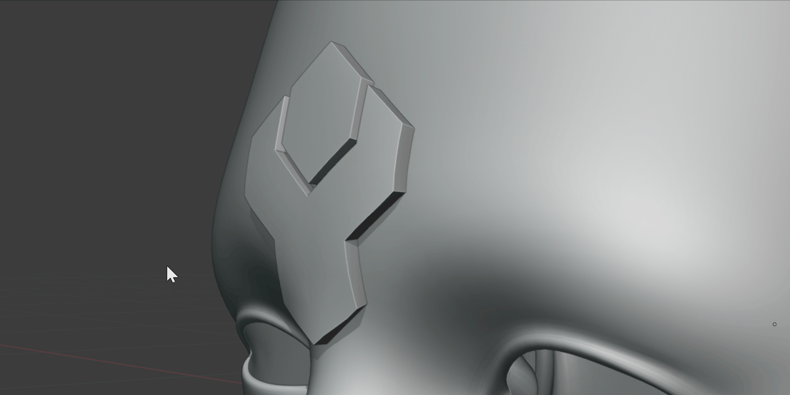

#####################################
Apply
#####################################

    Apply the conform operation.  This will apply the modifiers, remove the vertex groups and the hidden deformation grid.

If you wish to edit the conformed object after it has been deformed, the **Apply Conform** operation will apply all related modifiers, delete the grid object, and remove the vertex groups all in one click:

#. Select the Source Object
#. Right-click and select the **Conform Object** context menu.
#. Select the **Apply Conform** option.

This will remove all modifiers and vertex groups that may have been created during the operation.