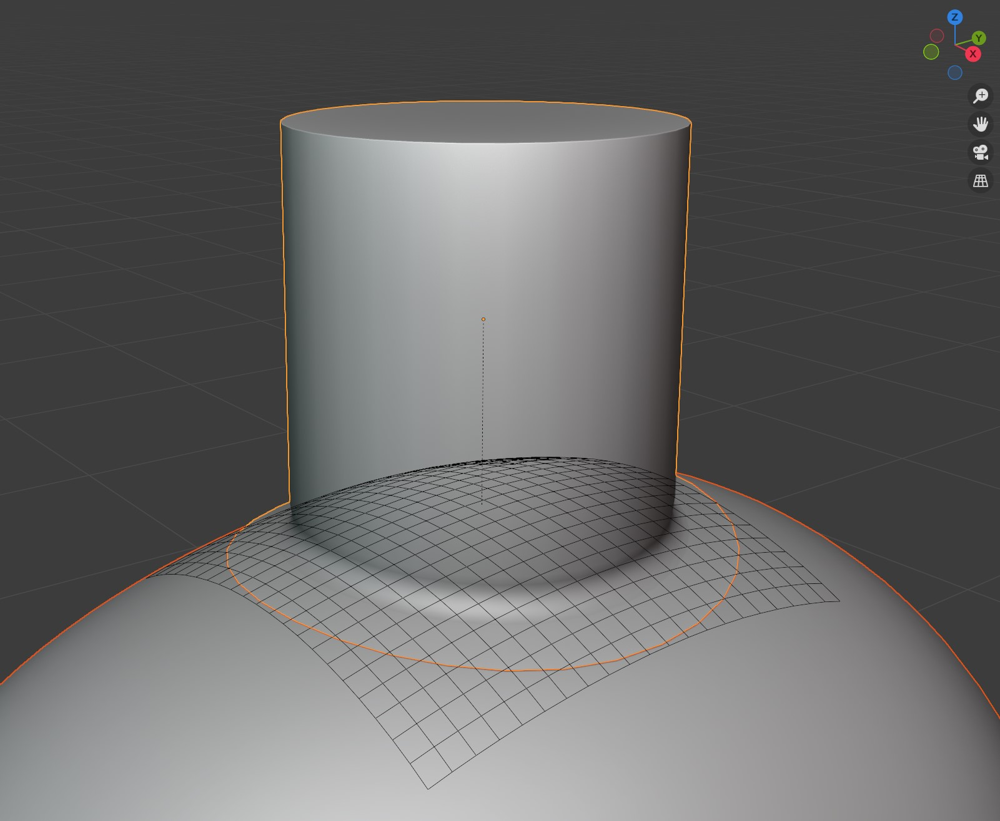
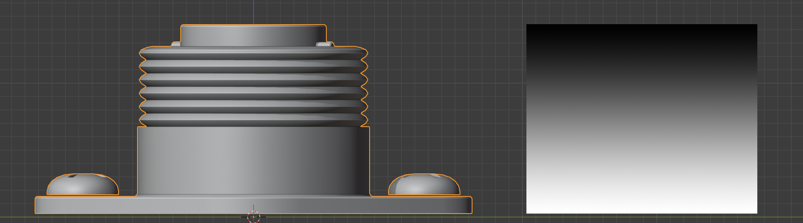
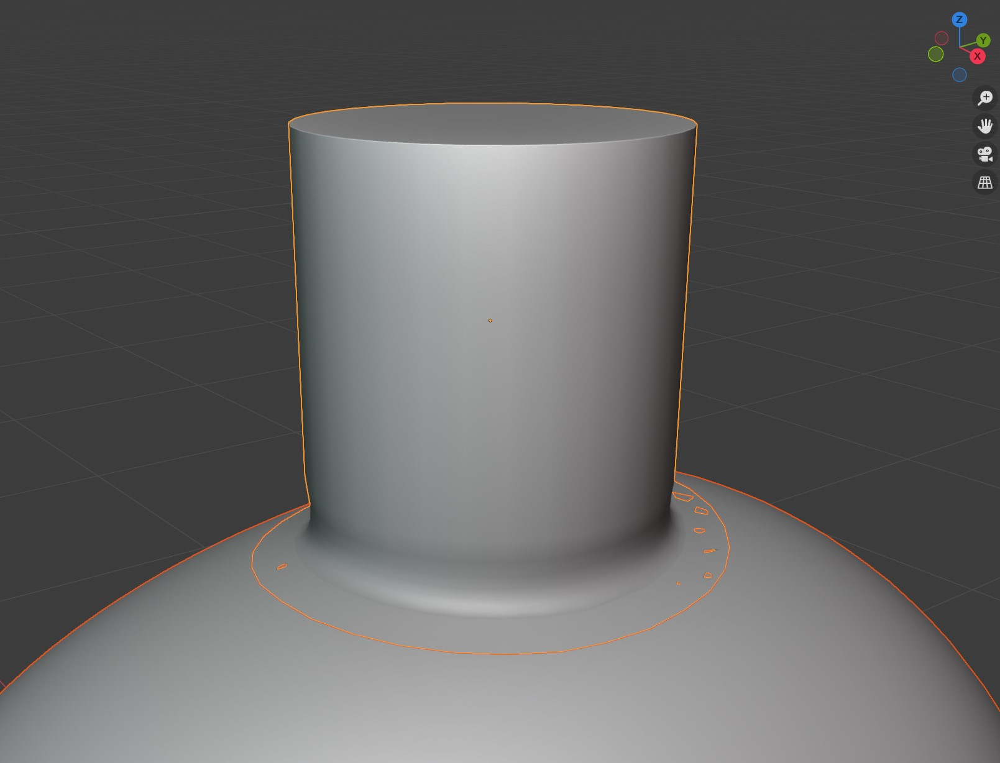

#####################################
How does it work?
#####################################

The add-on has two modes; :ref:`Grid Mode` (default) and :ref:`Shrinkwrap Mode`.

The manual processed for both has been best described in |this video| but is also described below.

==============================
Grid Mode
==============================

* **Advantages**: 
  
    * More accurate, positions the source object vertices in the same direction as the faces of the target object.
  
* **Disadvantages**: 
  
    * More complex, adds an extra helper grid object to the scene.
  
    * If the source object is edited or copied, you will need to re-apply the operation.

    The add-on in Grid Mode, with the grid visible.

The add-on automatically creates a deformation grid object which is used to wrap the object to the surface of another using a |Surface Deform Modifier|.  This grid object is **hidden** by default and can have its subdivisions configured.

It automates the manual process of:

#. Creating a deformation grid and aligning it to the base of the object.
#. Adding a |Surface Deform Modifier| and associating it with the Grid.
#. Adding a |Shrinkwrap Modifier| to the grid and associating it with that object.
#. Adding a |vertex group| weighting to the object from the bottom to the top to control :ref:`the influence of the deformation<Gradient Effect>`.

The deformation grid is automatically deleted if the source object is deleted.

.. |Surface Deform Modifier| raw:: html

   <a href="https://docs.blender.org/manual/en/latest/modeling/modifiers/deform/surface_deform.html" target="_blank">Surface Deform Modifier</a>

    The default vertex group weighting.

==============================
Shrinkwrap Mode
==============================

* **Advantages**: 
  
    * Simpler, only a |shrinkwrap modifier| is added to the target object.
  
    * You do not need to re-run the operation when the object is edited.
  
* **Disadvantages**: 
  
    * Not as accurate; does not align vertices
  
    * It will flatten the lower parts of the object in many cases.

    The add-on in Shrinkwrap Mode.

For the shrinkwrap modifier mode, it automatically:

#. Adds a |Shrinkwrap Modifier| to the mesh.
#. Adding a |vertex group| weighting to the object from the bottom to the top to control :ref:`the influence of the deformation<Gradient Effect>`.

    The default vertex group weighting.

.. |this video| raw:: html

   <a href="https://youtu.be/luFz5gzvM9s" target="_blank"><b>this video</b></a>

.. |Shrinkwrap Modifier| raw:: html

   <a href="https://docs.blender.org/manual/en/latest/modeling/modifiers/deform/shrinkwrap.html" target="_blank">Shrink Wrap Modifier</a>

.. |Vertex Group| raw:: html

   <a href="https://docs.blender.org/manual/en/latest/modeling/meshes/properties/vertex_groups/introduction.html" target="_blank">Vertex Group</a>

