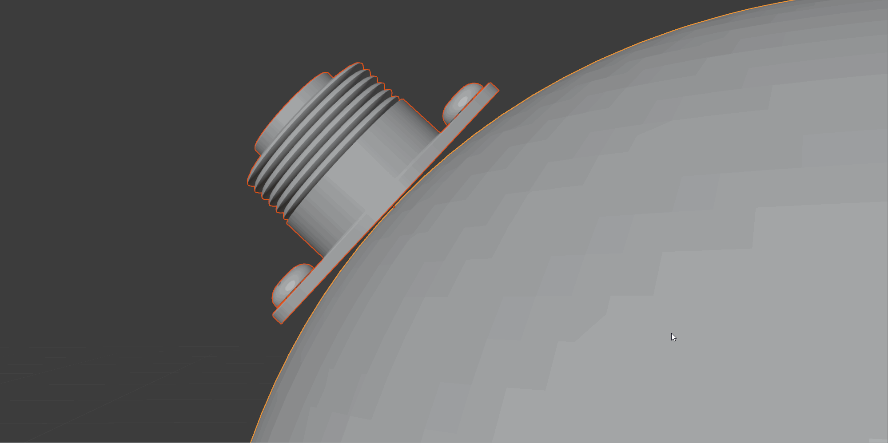

.. Conform Object documentation master file, created by
   sphinx-quickstart on Sat Oct  9 12:42:16 2021.
   You can adapt this file completely to your liking, but it should at least
   contain the root `toctree` directive.

==========================================
Conform Object
==========================================

  Conform Object at work

---------------------------------
What is Conform Object?
---------------------------------

|Conform Object| is a Blender add-on for any 3D modeler that needs to project objects onto another object's surface in one action.

The add-on handles the complexity of doing this for you in a non-destructive way.  

.. |Conform Object| raw:: html

   <a href="https://blendermarket.com/products/conform-object">Conform Object</a>

-----------------
Features:
-----------------

* Simple right-click menu option performs the :ref:`operation in one go<How to Use>`.
* :ref:`Graduate the effect<Gradient Effect>` from the bottom to the top of the object.
* Choose from :ref:`Grid Mode` or :ref:`Shrinkwrap Mode`.
* Transfer surface normals to :ref:`blend object shading<Blend Normals>`.
* Use a :ref:`deformation lattice<Lattice Deformation>` to stretch an object around the surface of another.
* Underlying mesh is not affected.
* Undo and apply options handle the underlying complexity of adding and removing modifers.
* :ref:`Conform multiple objects at once<Multiple Objects>`.
* :ref:`Display Vertex Weights in Object Mode<Visualize Vertex Weights>` to help with the :ref:`Gradient Effect`.
* Presets system to save your preferred settings.

.. figure:: images/lattice_feature_demo.gif
    :alt: Conform Lattice Deformation

    Using the advanced :ref:`Lattice Deformation<Lattice Deformation>` feature to wrap an object around another.

.. figure:: images/conform_obj_3.gif
  :alt: Conform Object at work

  Here the :ref:`Gradient Effect` is used to affect the lower parts of the object, and leave the upper part unaffected.

.. toctree::
   :maxdepth: 2
   :caption: Contents:

   installation
   use
   options
   undo
   apply
   toggle_snap
   lattice
   vertex_weight_vis
   how_does_it_work
   troubleshooting
   contact

Indices and tables
==================

* :ref:`genindex`
* :ref:`modindex`
* :ref:`search`
