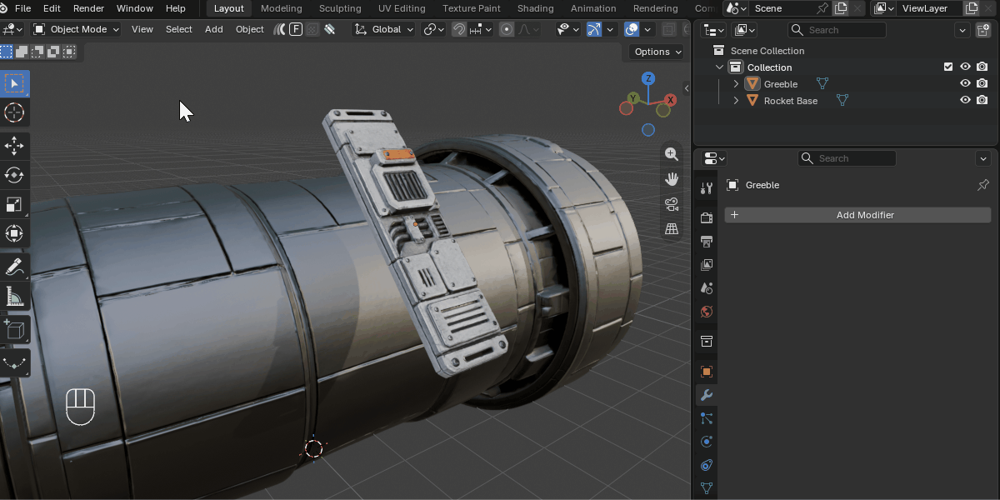

.. _conform_object_modifier:

###########################
Conform Object Modifier
###########################

.. note::

     Blender 4.5 or higher.
     
************************
Modifier Overview
************************

The Conform Object modifier gives users an alternative more configurable way to project the geometry of one object onto the surface of another.

As it is a modifier, the mesh can be adjusted, animated, and re-conformed in real-time.

The resulting deformation can be controlled as before using gradients, offset distance, normal blending, and grid-based smoothing.

Advantages
================

* Real-time feedback when adjusting the source mesh.
* Non-destructive workflow with the ability to stack multiple modifiers.
* Compatibility with other modifiers in the stack.
* Animation support for parameters.

Disadvantages
================

* The :ref:`Lattice Deformation<Lattice Deformation>` feature is currently not supported in the modifier.
* Less tried and tested than the operator version.

.. note::

    If you have any questions about using the Conform Object Modifier, please :ref:`contact us<contact>`.

************************
Basic Usage
************************

Follow the instructions in the :ref:`operator version<How to Use>`, but instead of selecting the **Conform Object** menu option, select **Add Conform Object Modifier** from the menu panel instead.

.. note::

    Remember to :ref:`align the object correctly<stepbystep>` before adding the modifier.

************************
Modifier Options
************************

.. note::

    See the add-on's main :ref:`Options<options>` section for detailed information on how to use the options below.

Target Object
================

Specifies the object onto which the source geometry will be conformed.

Amount
============================

Controls the strength of the conform deformation.

* **`0.0`**: No deformation
* **`1.0`**: Full conformity

Modifier Projection
============================
     
Controls how vertices are projected toward the target surface.

Offset
--------------------

Adds an offset distance after projection along the projection direction. Good for Floating geometry above the target and creating spacing for decals.

Center Point
--------------------

Defines the reference point used when calculating projection directions.

* **Middle Point**: Uses the bounding box center of the source object
* **World Center**: Uses the object's origin point in the scene.

Modifier Method
--------------------

Defines how vertices are projected out from the target object.

*  **Surface**: Projects outward the target surface's face directions.
*  **Direct**: Projects vertices in one direction from the target volume.

Modifier Direction
--------------------

Controls how projection directions from source to target are calculated.

* **Auto**: Automatically determines a suitable projection direction, either by axis line, or if not the nearest point.
* **Axis Line**: Projects along the object's -Z axis.
* **Nearest**: Finds the nearest point on the target object from the source object.
* **Custom**: Uses a user-defined projection direction.

Modifier Gradient Effect
==========================================

See the :ref:`Gradient Effect` section in the main documentation for full details.

Applies a spatial falloff, allowing partial deformation across the mesh.

Start
-------

Defines where the gradient begins.

End
-------

Defines where the gradient reaches full effect.

Vertices between **Start** and **End** are progressively affected.

Modifier Blend Normals
==========================================

See the :ref:`Blend Normals` section in the main documentation for full details.

Blends the surface normals of the source object with those of the target.

This improves shading continuity.

Blend Start
--------------

Defines where normal blending begins.

Blend End
--------------

Defines where full normal blending is reached.

Deformation Grid
=====================

Controls the hidden backing grid that defines the deformation. See :ref:`How Does it Work?<how_does_it_work>` for more information.

Display Grid
---------------------

Displays the deformation grid as a wireframe in the viewport for debugging and tuning.

.. note::

    The viewport must be set to Wireframe or Solid mode to view the grid. 

Subdivision X / Y
---------------------

Controls grid resolution.

* Higher values increase smoothness
* Lower values improve performance

Grid Smoothing
---------------------

Applies subdivision surface smoothing to the deformation grid.

Useful for removing minor surface artifacts and softening transitions in the deformation.

Workflow Tips
=====================

* If your object has quad based topology, placing **Subdivision Surface** before Conform Object in the modifier stack can make the object deform more smoothly.

Questions?
=====================

If you have any questions about using the Conform Object Modifier, please :ref:`contact us<contact>`.
