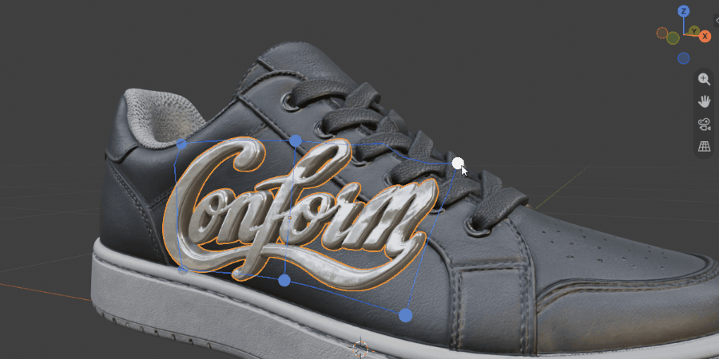
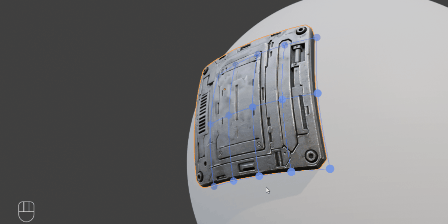
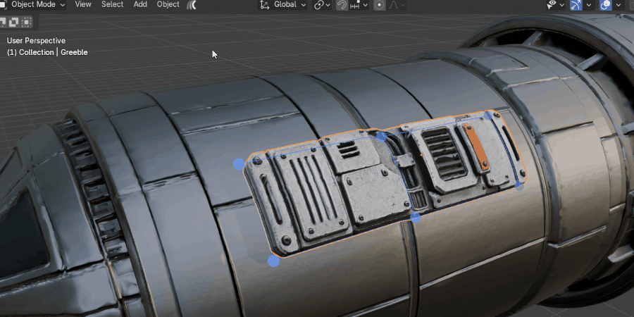
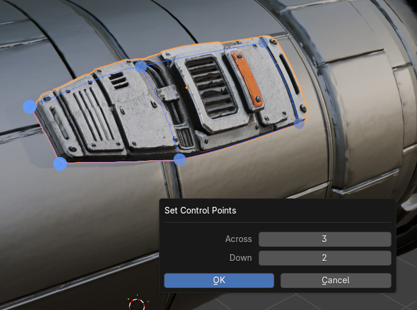
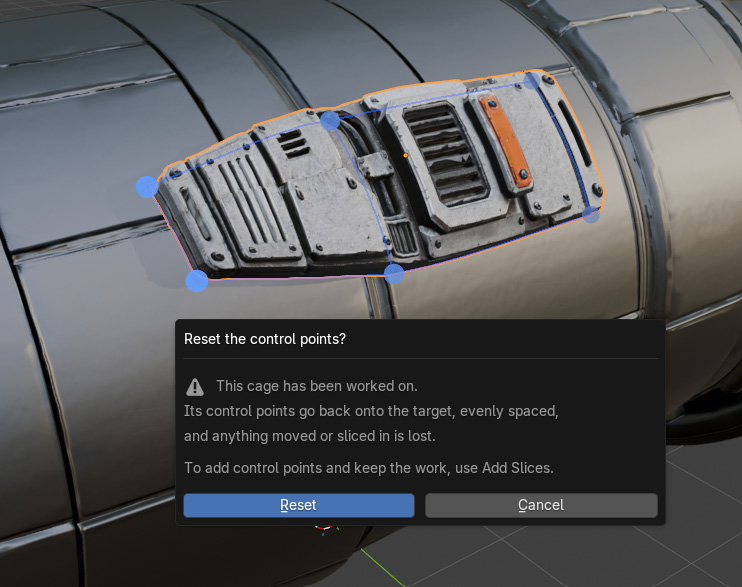
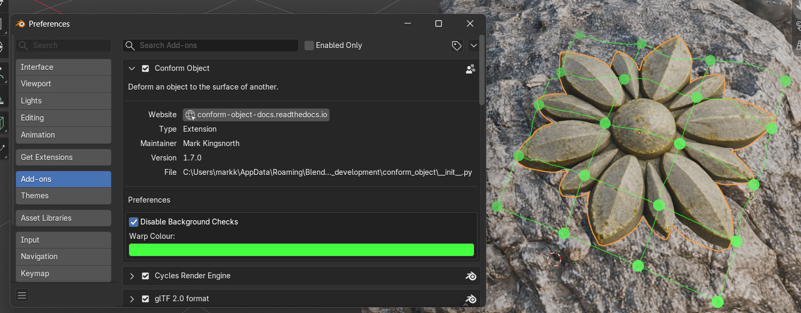

.. _conform_object_modifier:

###########################
Conform Object Modifier
###########################

.. note::

     Blender 4.5 or higher.
     
************************
Modifier Overview
************************

The Conform Object modifier gives users an alternative more configurable way to project the geometry of one object onto the surface of another.

As it is a modifier, the mesh can be adjusted, animated, and re-conformed in real-time.

The resulting deformation can be controlled as before using gradients, offset distance, normal blending, and grid-based smoothing.

Advantages
================

* Real-time feedback when adjusting the source mesh.
* Non-destructive workflow with the ability to stack multiple modifiers.
* Compatibility with other modifiers in the stack.
* Animation support for parameters.

Disadvantages
================

* The :ref:`Lattice Deformation<Lattice Deformation>` feature is currently not supported in the modifier.
  :ref:`Warp Control Points<Warp Control Points>` are the modifier's own way of shaping the result by hand.
* Less tried and tested than the operator version.

.. note::

    If you have any questions about using the Conform Object Modifier, please :ref:`contact us<contact>`.

************************
Basic Usage
************************

.. image:: images/conform_object_modifier_action.gif
    :alt: Conform Object Modifier in Action

Follow the instructions in the :ref:`operator version<How to Use>`, but instead of selecting the **Conform Object** menu option, select **Add Conform Object Modifier** from the menu panel instead.

.. note::

    Remember to :ref:`align the object correctly<stepbystep>` before adding the modifier.

************************
Applying and Removing
************************

Alongside **Add Conform Object Modifier**, the same menu also offers:

* **Apply Conform Object Modifier** — bakes the deformation into the mesh and removes the modifier, exactly like using **Apply** from the modifier panel itself. If the Conform Object modifier isn't first in the object's modifier stack, a warning is shown before applying, matching Blender's own built-in behaviour for out-of-order modifier apply.
* **Delete Conform Object Modifier** — removes the modifier without applying it, discarding the deformation.

Both act on every selected object that has the modifier, so you can apply or delete it across several objects at once.

.. note::

    These menu items are a convenience — you can always Apply or Remove the modifier directly from the Modifier Properties panel instead.

************************
Warp Control Points
************************

..
    Screenshot placeholder: warp_feature_demo.gif
    A short loop showing a decal already conformed, the control points
    appearing, and one or two being dragged so the decal follows.  This is the
    one to lead with.

**Warp** adds draggable control points to a Conform Object modifier, so you can push the conformed geometry around by hand after it has landed.

Conform Object decides where your geometry goes.  Warp lets you overrule it, without leaving the modifier or touching the underlying mesh.

The control points sit on the target's surface and are dragged along it, so the geometry stays conformed while you reshape it.

.. note::

    Warp is part of the modifier.  It is not available in the operator version, and like the rest of the modifier it needs Blender 4.5 or higher.

Turning the Warp On
=====================

#. Add a Conform Object modifier as described above, and make sure it is the selected modifier in the stack.
#. From the **Object** menu (or the right-click menu), choose **Conform Object**, then **Warp**, then **Enable Warp**:

    .. image:: images/warp_menu.jpg
        :alt: The Warp submenu

    ..
        Screenshot placeholder: warp_menu.jpg
        The Object > Conform Object menu open with the Warp submenu showing
        all of its entries.

#. You are asked how many control points to start with, across and down.  It opens at the number you last used:

    .. image:: images/warp_enable_dialog.jpg
        :alt: Choosing the number of control points

    ..
        Screenshot placeholder: warp_enable_dialog.jpg
        The small Enable Warp dialog with Across and Down.

#. The control points appear on the target's surface, joined by guide lines showing the grid they drive:

    .. image:: images/warp_control_points.jpg
        :alt: Control points on the surface

    ..
        Screenshot placeholder: warp_control_points.jpg
        A conformed decal with a 3 by 3 set of control points and the guide
        lines between them.

.. note::

    Start with a small number.  Control points are easier to add where you need them than to take away, and fewer of them gives a smoother result.

.. tip::

    Hold **Ctrl** while choosing **Add Conform Object Modifier** to conform the object and put the control points on in one go, without being asked how many.  It uses the number you last set, so set it once and Ctrl follows it from then on.

Moving Control Points
=====================

Click and drag a control point.  It travels across the target's surface, and the conformed geometry follows it.

* The lines between control points preview the grid that will be built.
* Control points are drawn as solid discs.  Nearer ones are larger and in full colour, while further ones shrink and sink towards the viewport's background, so you can tell which is in front when the surface curves away from you.
* The control point under the mouse turns white.
* Each drag is a separate undo step.

..
    Screenshot placeholder: warp_dragging.gif
    A single control point being dragged across the surface with the geometry
    following it.

Adding and Removing Lines of Control Points
============================================

Rather than raising the number of control points everywhere, you can put a single line exactly where you need one.

Choose **Add Slices** from the Warp menu, then click on the target where the new line should go:

..
    Screenshot placeholder: warp_add_slices.gif
    The Add Slices tool running: the preview line following the mouse, then a
    couple of clicks putting lines in.

* The direction is chosen for you, from whichever existing line your mouse is nearest.  Move towards a row to add a row, towards a column to add a column.
* The tool stays running, so you can put several lines in one after another.
* **Right-click** or press **Escape** to finish.
* Hold **Ctrl** to take a line out instead of putting one in, without leaving the tool.
* You can orbit, pan and zoom while it is running.
* The mouse pointer shows which way round the tool is: a knife while lines are going in, an eraser while they are coming out.

**Remove Slices** is the same tool started the other way round, and Ctrl swaps it back.

.. note::

    Adding a line leaves the control points already there exactly where they are, so you do not lose work you have already done.  The shape does shift very slightly as the new line joins in, because a smooth curve through more points is a slightly different curve.

Changing the Number of Control Points
======================================

**Set Control Points** changes how many there are, across and down:

..
    Screenshot placeholder: warp_set_control_points.jpg
    The Set Control Points dialog.

This starts the grid again, evenly spaced and back on the target, so anything you have dragged is lost.  If there is work to lose, you are asked first:

..
    Screenshot placeholder: warp_reset_warning.jpg
    The confirmation dialog that appears when there is work to lose.

.. note::

    To add control points and keep your work, use **Add Slices** instead.

The number you set here is the number everything else starts from: both dialogs open at it, and holding Ctrl uses it.

.. note::

    It is remembered for as long as the file is open, and is not saved with it.  Opening another file starts again at 2 by 2.  Slicing lines in does not change it -- slicing a 3 by 3 up to 5 by 3 leaves the remembered number at 3 by 3, so Set Control Points still offers what you chose rather than what slicing made of it.

Resetting and Removing
=======================

* **Reset Warp** moves every control point back to where it started, undoing your dragging.  Lines you have sliced in stay where you put them.
* **Remove Warp** takes the control points away and gives back the unwarped result.  Anything you dragged is lost.

.. note::

    You do not have to remove the Warp before removing or applying the modifier.  **Remove Warp** is for when you want to keep the conformed result but be rid of the control points.

The Control Point Object
=========================

The control points live on a hidden object of their own, named after the object it belongs to and parented to it, so it travels with the object.

* One set of control points belongs to one modifier.
* Duplicating a conformed object gives the copy its own control points the first time you work on them, so the two do not share.
* You should not need to touch this object.  If it is deleted, the add-on builds a new one the next time you use a Warp tool.

Appearance
===========

The colour of the grid lines can be changed in the add-on's preferences under **Warp Colour**.  The control points themselves are drawn a lighter shade of it:

..
    Screenshot placeholder: warp_colour_preference.jpg
    The add-on preferences showing Warp Colour.

Everything the warp draws follows the viewport's **Overlays** button, so switching overlays off hides the control points and the guide lines together, leaving the conformed result to be judged on its own.

Notes and Limits
=================

* A coarse set of control points drapes cleanly over about half of a rounded object.  Pulled much further round than that, the grid can fold back on itself.  Adding control points where it folds is the fix.
* Very dense source meshes are slower to warp, because the deformation is recalculated as you drag.  Lowering **Subdivision X / Y** while you work and raising it again afterwards keeps things responsive.

Questions about Warp?
======================

If something does not behave as you expect, please :ref:`contact us<contact>` -- and if you can, send the .blend file.  How the warp behaves depends a great deal on the shape of the target underneath it.

************************
Modifier Options
************************

.. note::

    See the add-on's main :ref:`Options<options>` section for detailed information on how to use the options below.

Target Object
================

Specifies the object onto which the source geometry will be conformed.

Amount
============================

Controls the strength of the conform deformation.

* **`0.0`**: No deformation
* **`1.0`**: Full conformity

Modifier Projection
============================
     
Controls how vertices are projected toward the target surface.

Offset
--------------------

Adds an offset distance after projection along the projection direction. Good for Floating geometry above the target and creating spacing for decals.

Center Point
--------------------

Defines the reference point used when calculating projection directions.

* **Middle Point**: Uses the bounding box center of the source object
* **World Center**: Uses the object's origin point in the scene.

Modifier Method
--------------------

Defines how vertices are projected out from the target object.

*  **Surface**: Projects outward the target surface's face directions.
*  **Direct**: Projects vertices in one direction from the target volume.

Modifier Direction
--------------------

Controls how projection directions from source to target are calculated.

* **Auto**: Automatically determines a suitable projection direction, either by axis line, or if not the nearest point.
* **Axis Line**: Projects along the object's -Z axis.
* **Nearest**: Finds the nearest point on the target object from the source object.
* **Custom**: Uses a user-defined projection direction.

Modifier Gradient Effect
==========================================

See the :ref:`Gradient Effect` section in the main documentation for full details.

Applies a spatial falloff, allowing partial deformation across the mesh.

Start
-------

Defines where the gradient begins.

End
-------

Defines where the gradient reaches full effect.

Vertices between **Start** and **End** are progressively affected.

Modifier Blend Normals
==========================================

See the :ref:`Blend Normals` section in the main documentation for full details.

Blends the surface normals of the source object with those of the target.

This improves shading continuity.

Blend Start
--------------

Defines where normal blending begins.

Blend End
--------------

Defines where full normal blending is reached.

Deformation Grid
=====================

Controls the hidden backing grid that defines the deformation. See :ref:`How Does it Work?<how_does_it_work>` for more information.

Display Grid
---------------------

Displays the deformation grid as a wireframe in the viewport for debugging and tuning.

.. note::

    The viewport must be set to Wireframe or Solid mode to view the grid. 

Subdivision X / Y
---------------------

Controls grid resolution.

* Higher values increase smoothness
* Lower values improve performance

Grid Smoothing
---------------------

Applies subdivision surface smoothing to the deformation grid.

Useful for removing minor surface artifacts and softening transitions in the deformation.

Workflow Tips
=====================

* If your object has quad based topology, placing **Subdivision Surface** before Conform Object in the modifier stack can make the object deform more smoothly.

Questions?
=====================

If you have any questions about using the Conform Object Modifier, please :ref:`contact us<contact>`.
