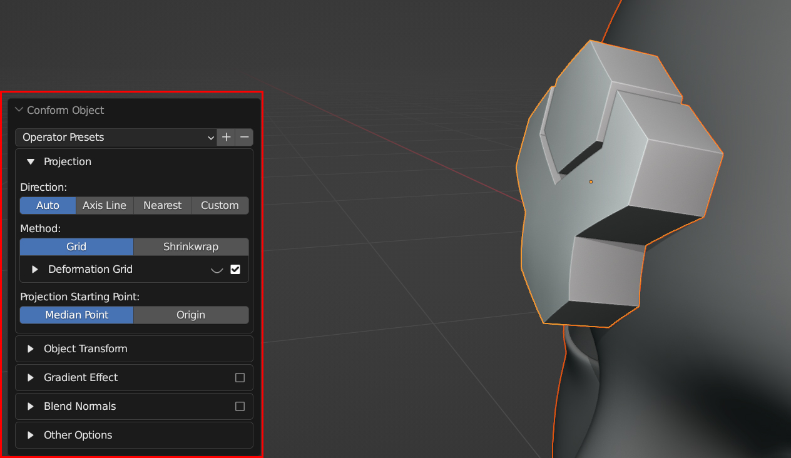

#####################################
Options
#####################################

  Options Panel in the bottom left of the viewport

=====================
Presets
=====================

You can add or remove preset configurations from the tool here by pressing the **+** or **-** keys, or reset the tool to its default parameters.

=======================
Source Object
=======================

The following controls the parameters of how the source object is applied:

Method
--------------------

Choose between :ref:`Grid Mode` or :ref:`ShrinkWrap Mode`.

Gradient Effect
--------------------
This creates a vertex group which automatically weights the vertices at the bottom so the effect is less exagerated at the top:
  
.. figure:: images/conform_obj_2.gif
    :alt: Conform Object at work

    The add-on allows you to control the influence of the deformation.  In this case, we do not want the threads of the screws to be affected, so we reduce the "End Point" parameter so that the effect finishes towards the bottom of the object.

End Point
^^^^^^^^^^^^^^^^^^^^^^^^^^^^^^^^^^^^^^^

This controls when the gradient effect of the vertices ends, 1.0 being at the top of the object.  Lower values will stop the deformation towards the bottom of the object, and higher values will extend the weight beyond the top of the object.

.. figure:: images/vertex_group_weighting.jpg
    :alt: Vetex Group Weighting

    The default vertex group weighting, where the effect is gradually reduced towards the top (End Point=1.0)

.. figure:: images/vertex_group_weighting_0.1.jpg
    :alt: Vetex Group Weighting

    A lower vertex group weighting, where the effect is gradually reduced further towards the bottom (End Point=0.1)

.. figure:: images/vertex_group_weighting_2.0.jpg
    :alt: Vetex Group Weighting

    A higher vertex group weighting, where the effect is gradually reduced beyond the top of the object (End Point=2.0)

Blend Normals
------------------------------

This will blend the normals of the source object with the target object, creating a smoother transition between the two object surfaces:

.. figure:: images/gradient_effect_2.jpg
  :alt: Some simple 'horns' applied using the add-on.  They are all separate objects.

  Some simple 'horns' applied using the add-on.  They are all separate objects.

.. figure:: images/gradient_effect_1.jpg
  :alt: Here the normals of the 'horns' are blended with the normals of the head.

  Here the normals of the same 'horn' objects are blended with the normals of the head.  They remain separate objects.

This effect is achieved by using a |Data Transfer Modifier| on the Source Object.

.. |Data Transfer Modifier| raw:: html

   <a href="https://docs.blender.org/manual/en/latest/modeling/modifiers/modify/data_transfer.html" target="_blank">Data Transfer Modifier</a>

End Point (Blend Normals)
^^^^^^^^^^^^^^^^^^^^^^^^^^^^^^^^^^^^^^^

As with the :ref:`End Point` controls for the :ref:`Gradient Effect`, this controls which face normals are affected.

Blend Whole Object
^^^^^^^^^^^^^^^^^^^^^^^^^^^^^^^^^^^^^^^

This will blend all of the object's normals regardless of the gradient effect.

Add Simple Subdivisions
------------------------------

This adds a |Subdivision Surface modifier| to the source object, set to 'simple', in case you wish to quickly subdivide the mesh when conforming the object.

* **Subdivisions**: The number of subdivisions to use in the modifier.

.. |Subdivision Surface modifier| raw:: html

   <a href="https://docs.blender.org/manual/en/latest/modeling/modifiers/generate/subdivision_surface.html" target="_blank">Subdivision Surface modifier</a>

Align Object to Face
------------------------------

This will automatically align the source object to the face of the target object it is being applied to if it is not already.

Collapse Modifiers
------------------------------

This will collapse the existing modifiers on the source object if they are interfering with the conform effect.

=======================
Grid Object
=======================

This controls the nature of the deformation grid used in :ref:`Grid Mode`.  It is a regular blender object, parented to the source object, but is configurable by the add-on:

Hide Grid
------------------------------

By default, the deformation grid is hidden but it can be displayed if you wish to configure it:

.. figure:: images/hide_grid.gif
  :alt: The deformation grid is revealed!

  The deformation grid is revealed!

Grid Subdivisions
------------------------------

.. figure:: images/grid_subd.gif
  :alt: Subdividing the grid increases the resolution of the deformation.

  Subdividing the grid increases the resolution of the deformation.

The number of vertices in the grid.  If you are deforming over particularly smoothed or high resolution meshes, increasing this number can be useful.

Grid X/Y
-------------

.. figure:: images/move_grid_x.jpg
  :alt: Grid moved in X direction.

  Grid moved in X direction.

Move the grid's X/Y position.

Grid Scale X/Y
--------------------------

.. figure:: images/grid_scale.gif
  :alt: Scale the influence of the grid.

  Scale the influence of the grid.

Scale the grid in the X/Y direction.

Grid Rotation
--------------------------

.. figure:: images/grid_rotation.gif
  :alt: Grid rotated on surface.

  Grid rotated on surface.

Rotate the grid over the surface.

Interpolation Falloff
--------------------------

Used on the |Surface Deform Modifier| for the grid. From the |documentation|: 

*"How much a vertex bound to one face of the target will be affected by the surrounding faces (this setting is unavailable after binding). This essentially controls how smooth the deformations are."*

.. |Surface Deform Modifier| raw:: html

   <a href="https://docs.blender.org/manual/en/latest/modeling/modifiers/deform/surface_deform.html" target="_blank">Surface Deform Modifier</a>

.. |documentation| raw:: html

   <a href="https://docs.blender.org/manual/en/latest/modeling/modifiers/deform/surface_deform.html" target="_blank">documentation</a>