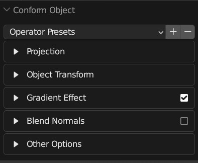
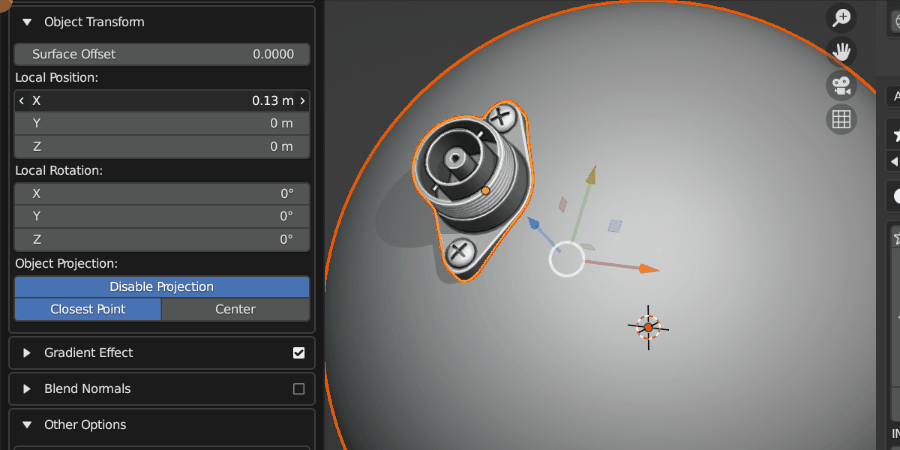
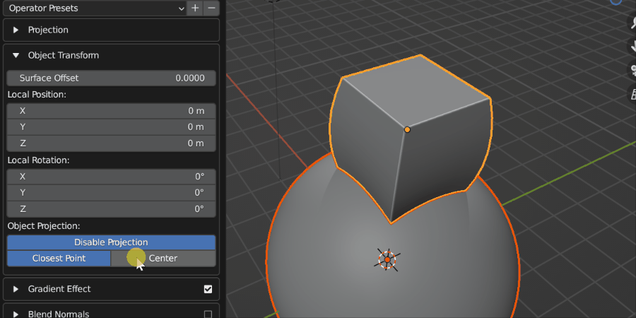
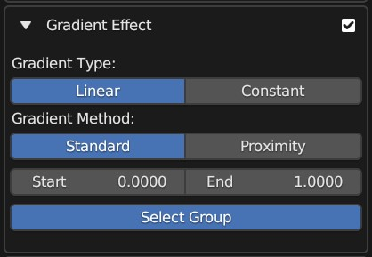
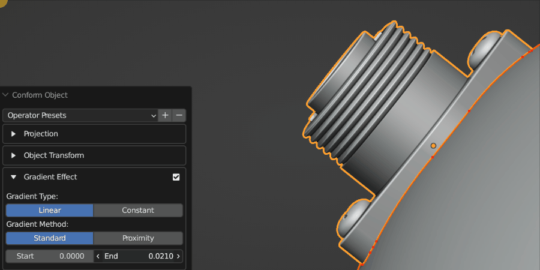
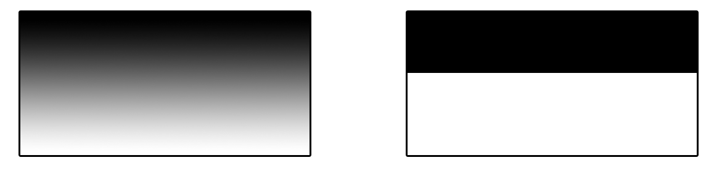

#####################################
Options
#####################################

.. figure:: images/object_conformed_panel.gif
  :alt: Options Panel in the bottom left of the viewport

  Options Panel in the bottom left of the viewport

    The options panel with each section collapsed.

=====================
Operator Presets
=====================

You can add or remove preset configurations from the tool here by pressing the **+** or **-** keys, or reset the tool to its default parameters.

=======================
Projection
=======================

.. figure:: images/panel_projection.jpg
    :alt: Conform Object at work

    The expanded Projection Panel

The following controls the parameters of how the source object is projected onto the Target Object:

Direction
--------------------

.. figure:: images/object_conformed_direction.gif
    :alt: Conform Object at work

    A source object having its projection direction changed by *custom* mode (Grid mode visibility is turned on).  When the direction line hits the Target Object, the Source Object begins to conform.

The different *Direction* modes control how the direction line is chosen when projecting the **Source Object**.  You may wish to enable Grid visibility to see the different modes working:

  * **Auto**: This mode will first try to project the Source Object onto the Target Object using the *negative Z* direction as usual, and if that fails, it will instead project onto the closest point on the Target Object.
  * **Axis Line**: This will project a line from the middle of the **Source Object** in the |local| X, Y or Z direction with the object's rotation taken into account.  By default, the projection is in the local -Z direction.  If the line misses, a warning message will be displayed.
  * **Nearest**: This will project a line from the middle of the **Source Object** to the *closest point* on the Target Object.  You may need to use the Transform Orientation section to adjust the position of the object whilst it is being projected.
  * **Custom**: Specify a X/Y/Z rotation for the projection line.

.. |local| raw:: html

   <a href="https://youtu.be/ifoUhGTaVyM" target="_blank"><i>local</i></a>

Method
--------------------

This is the method used to deform the **Source Object**. Choose between :ref:`Grid Mode` or :ref:`ShrinkWrap Mode`:

* **Grid Mode**: This mode is :ref:`described here <Grid Mode>`, and creates a projection grid object which is attached to the source object to create the deformation.   The grid object is a regular blender object, parented to the source object.

  * **Visibility**: The grid object is hidden by default, but can be revealed by clicking the eye icon next to the *Deformation Grid* section:
    
        .. figure:: images/object_conformed_grid_on_off.gif
            :alt: Conform Object at work

            Switching on and off Grid visibility.

        .. tip::

            If you wish to hide the Grid again after the Conform Object operation is performed and the panel is gone, expand the Source Object in the Outline View to find the grid object:
            
            .. figure:: images/grid_selection.jpg
                :alt: Selecting the Grid on the Outline View.

                Selecting the Grid on the Outline View.

            Then make sure you have the *Disable In Viewports* flag ticked in the filters section of the Outline view:

            .. figure:: images/restriction_toggles.jpg
                :alt: Selecting the *Disable in Viewports* flag.

                Selecting the *Disable in Viewports* flag.

            You can then hide the grid object completely again by clicking this flag next to the object in the Outliner view:

            .. figure:: images/grid_hidden.jpg
                :alt: The grid is hidden again.

                The grid is hidden again.

  * **Grid options**:  By expanding the *Deformation Grid* section, you can change the default parameters of the grid:

        .. figure:: images/conform_object_grid_options.jpg
            :alt: Conform Object at work

            Expanded Grid Options section.

        * **Show/Hide Grid**: By default, the deformation grid is hidden but it can be displayed if you wish to configure it. This is the same setting as the Eye icon in the *Deformation Grid* section header.

            .. figure:: images/hide_grid.gif
                :alt: The deformation grid is revealed!

                The deformation grid is revealed!

            

        * **Grid Smoothing**

            .. figure:: images/object_conformed_grid_smoothing.gif
                :alt: Subdividing the grid increases the resolution of the deformation.

                Applying a Subdivision Surface modifier to the grid for smoothing: Levels 0, 1 and 2 are applied here.

            This adds a *Subdivision Surface* modifier to the grid.  This helps smooth the deformation grid over jagged surfaces.

        * **Grid Subdivisions**

            .. figure:: images/grid_subd.gif
                :alt: Subdividing the grid increases the resolution of the deformation.

                Subdividing the grid increases the resolution of the deformation.

            Not to be confused with grid smoothing, this is the number of vertices in the grid.  If you are deforming over particularly smoothed or high resolution meshes, increasing this number can be useful.

        * **Grid X/Y**

            .. figure:: images/move_grid_x.jpg
                :alt: Grid moved in X direction.

                Grid moved in X direction.

            Move the grid's X/Y position.

        * **Grid Scale X/Y**

            .. figure:: images/grid_scale.gif
                :alt: Scale the influence of the grid.

                Scale the influence of the grid.

            Scale the grid in the X/Y direction.

          * **Grid Rotation**

            .. figure:: images/grid_rotation.gif
                :alt: Grid rotated on surface.

                Grid rotated on surface.

            Rotate the grid over the surface.

          * **Interpolation Falloff**: Used on the |Surface Deform Modifier| for the grid. From the Blender |documentation|: *"How much a vertex bound to one face of the target will be affected by the surrounding faces (this setting is unavailable after binding)."*

.. |Surface Deform Modifier| raw:: html

   <a href="https://docs.blender.org/manual/en/latest/modeling/modifiers/deform/surface_deform.html" target="_blank">Surface Deform Modifier</a>

.. |documentation| raw:: html

   <a href="https://docs.blender.org/manual/en/latest/modeling/modifiers/deform/surface_deform.html" target="_blank">documentation</a>

Projection Starting Point
----------------------------------------

This parameter controls where the beginning of the projection line from the Source Object to the Target Object should be:

* **Median Point**:  By default, the start of the projection line will be from the middle point of the Source Object's geometry.
* **Origin**: Alternatively, you can make the projection line start from the Source Object's origin point in the 3D scene.

=======================
Object Transform
=======================

.. figure:: images/conform_object_transform_options.jpg
    :alt: Object Transform Projection Options

    The expanded Object Transform Panel

These parameters control how the **Source Object** is positioned onto the **Target Object** during the *Conform Object* operation.

Surface Offset
----------------------------------------

This parameter controls how far away the **Source Object** is offset from the **Target Object**'s surface.

.. figure:: images/offset_eg.jpg
    :alt: Object Transform Projection Options

    Source Object being offset.

Local Position
----------------------------------------

Once the **Source Object** has been projected, this controls the relative position of the **Source Object**.

    Source Object being repositioned.

Local Rotation
----------------------------------------

This controls the rotation of the **Source Object** once it has been projected.  This is useful for adjusting the orientation of the object after the initial projection.

.. figure:: images/object_conformed_local_rotation.gif
    :alt: Object Transform Projection Options

    Source Object being rotated on the surface.

Object Projection
----------------------------------------

    The Source Object can either be projected onto the surface using its closest part or its center.

Here you can choose which point on the **Source Object** is used to position it on top of the **Target Object**'s surface.

* **Disable Projection**:  Disable projection entirely.  This will stop the Source Object from being moved, which can be useful when trying to manually place the Source Object using the *Local Position* and *Rotation* parameters.
* **Closest Point**: By default the closest point on the **Source Object** to the **Target Object** will be used to position the **Source Object** on top of the **Target Object**'s surface.
* **Center**: The center of the **Source Object**'s geometry will be used to place it on the surface of the Target Object, so the **Source Object** will be 'inside' the **Target Object** surface.

=======================
Gradient Effect
=======================

    The expanded Gradient Effect Panel.

The Gradient Effect creates a vertex group which automatically adds weighted values to the vertices at the bottom of the **Source Object** so the effect is less exaggerated at the top:
  

    The Gradient Effect allows you to control where the Source Object is deformed.  In this case, we do not want the threads of the screws to be affected, so we reduce the *End* parameter so that the effect finishes towards the bottom of the object.  
    
.. tip::

    .. figure:: images/vis_group_option.jpg
        :alt: Conform Object at work
        :width: 50%

    :ref:`View the Vertex Groups<Visualize Vertex Weights>` used by the Gradient Effect whilst using the add-on with :ref:`this additional feature<Visualize Vertex Weights>`.

Gradient Type
----------------------------------------

    The type of gradient to apply: *Linear* (Left), or *Constant* (Right)

This setting determines which style of gradient effect to apply:

* **Linear**: this will create a gradually decreasing effect between two values.
* **Constant**: this will create a hard falloff from 1 to 0.

Gradient Method
----------------------------------------

This controls the method used to apply Vertex Group weights in the Gradient Effect:

* **Standard**: By default the weighting will be strongest at the closest points on the Source Object to the Target Object.:

    .. figure:: images/standard_weighting.jpg
        :alt: Gradient method
        :width: 50%

* **Proximity**: The weighting will be strongest for vertices that are nearest the Target Object surface.  This is useful when attempted to set up objects that 'wrap' more to the Target Object when using :ref:`Shrinkwrap Mode`.

    .. figure:: images/proximity_weighting.jpg
        :alt: Gradient method
        :width: 50%

        Here the proximity gradient effect is applied, where projection has been disabled and instead the object has been positioned using local controls.  Instead of :ref:`Grid Mode`, :ref:`Shrinkwrap Mode` is being used instead. This helps wrap objects more, but may need adjusting manually after the Conform Object operation is performed.

Start/End
----------------------------------------

    Start/End controls

This controls when the gradient effect of the vertices starts and ends.  

A value of 0.0 is at the bottom of the object, and a value of 1.0 is at the top.  

Lowering the value of the *end* below 1.0 will stop the deformation towards the bottom of the object, and higher values will extend the weight beyond the top of the object.  Increasing the *start* value will start the weighting higher up the object.

.. figure:: images/vertex_group_weighting.jpg
    :alt: Veterx Group Weighting

    The default vertex group weighting, where the effect is gradually reduced towards the top (Start=0.0, End=1.0)

.. figure:: images/vertex_group_weighting_start_pt.jpg
    :alt: Veterx Group Weighting

    Vertex group weighting where the start point has been increased so the effect covers the lower part of the object entirely (Start=0.45, End=0.55)

.. figure:: images/vertex_group_weighting_0.1.jpg
    :alt: Veterx Group Weighting

    A lower vertex group weighting, where the effect is gradually reduced further towards the bottom (Start=0.0, End=0.1)

.. figure:: images/vertex_group_weighting_2.0.jpg
    :alt: Veterx Group Weighting

    A higher vertex group weighting, where the effect is gradually reduced beyond the top of the object (Start=0.0, End=2.0)

.. |overlays panel| raw:: html

   <a href="https://docs.blender.org/manual/en/latest/editors/3dview/display/overlays.html" target="_blank">overlays panel</a>

=======================
Blend Normals
=======================

.. figure:: images/conform_object_blend_normals_effect_options.jpg
    :alt: Conform Object at work

    The expanded Blend Normals Panel.

This will blend the normals of the source object with the target object, creating a smoother transition between the two object surfaces:

.. figure:: images/gradient_effect_2.jpg
  :alt: Some simple 'horns' applied using the add-on.  They are all separate objects.

  Some simple 'horns' applied using the add-on.  They are all separate objects.

.. figure:: images/gradient_effect_1.jpg
  :alt: Here the normals of the 'horns' are blended with the normals of the head.

  Here the normals of the same 'horn' objects are blended with the normals of the head.  They remain separate objects.

This effect is achieved by using a |Data Transfer Modifier| on the Source Object, and uses the same Blender Vertex Group weighting to control the effect in the same way as the :ref:`Gradient Effect` above.

.. |Data Transfer Modifier| raw:: html

   <a href="https://docs.blender.org/manual/en/latest/modeling/modifiers/modify/data_transfer.html" target="_blank">Data Transfer Modifier</a>

Gradient Type (Blend Normals)
----------------------------------------

As with the :ref:`Gradient Type` controls for the :ref:`Gradient Effect`, this controls which face normals are affected.

Gradient Method (Blend Normals)
----------------------------------------

As with the :ref:`Gradient Method` controls for the :ref:`Gradient Effect`, this controls which face normals are affected.

Start/End (Blend Normals)
----------------------------------------

As with the :ref:`Start/End` controls for the :ref:`Gradient Effect`, this controls which face normals are affected.

Blend Whole Object
----------------------------------------

This will blend all of the object's normals regardless of the gradient effect.

==========================
Other Options
==========================

Add Simple Subdivisions
------------------------------

This adds a |Subdivision Surface modifier| to the source object, set to 'simple', in case you wish to quickly subdivide the mesh when conforming the object.

* **Subdivisions**: The number of subdivisions to use in the modifier.

.. |Subdivision Surface modifier| raw:: html

   <a href="https://docs.blender.org/manual/en/latest/modeling/modifiers/generate/subdivision_surface.html" target="_blank">Subdivision Surface modifier</a>

Collapse Modifiers
------------------------------

This will collapse the existing modifiers on the source object if they are interfering with the conform effect.

Deform Modifier Position
------------------------------

This will change the position of the deformation modifier (Either :ref:`Surface Deformation<Grid Mode>` of :ref:`ShrinkWrap<ShrinkWrap Mode>`) on the source object:

* **Start**: At the start of the modifier stack.
* **Before**: This will place the modifier just before a specified modifier.  Selecting the option will allow you to specify which modifier.

    .. image:: images/mod_before.jpg
        :alt: Placing a modifier before another.

* **End**: At the start of the modifier stack.

Parent Source Object to Target Object
------------------------------------------------------------

Assign the Target Object as the parent of the Source Object.

.. warning::

    Parenting the Target Object cannot be automatically undone by the add-on