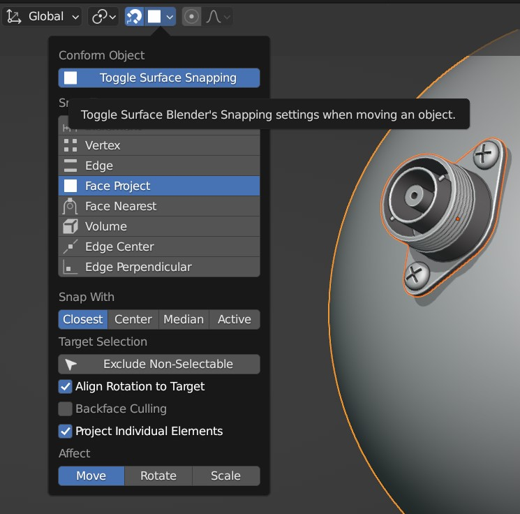

#####################################
Surface Snapping
#####################################

    The Toggle Surface Snapping option automatically enables surface snapping.

.. figure:: images/snap_anim.gif
    :alt: Object being snapped to a face while moving.

    Object being snapped to a face while moving.

To align an object to another object's surface, a common set up in Blender is to enable the relevant snap options:

    Snap Options for aligning an object to a face.

To quickly switch on these settings, an option is provided in the menu that allows you to toggle these settings on and off:

#. In the viewport, right-click and select the **Conform Object** context menu.
#. Select the **Toggle Surface Snapping** option.

This will automatically enable snapping options so that you can align the object to the surface quickly.