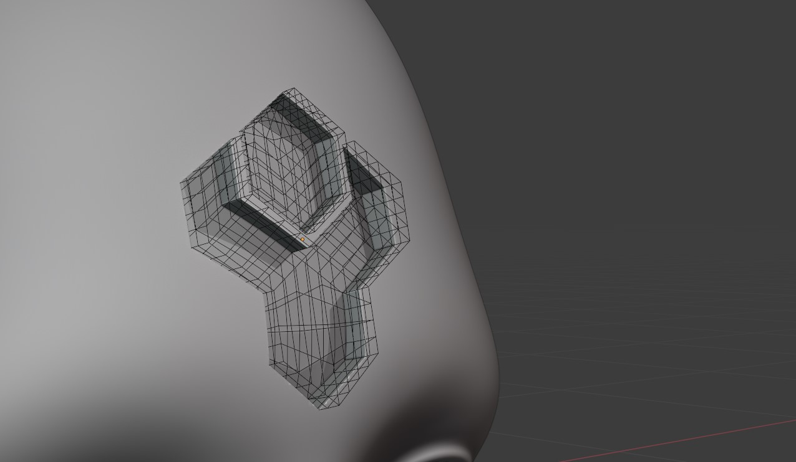

#####################################
Tips and Troubleshooting
#####################################

If you are having any issues do not hesitate to :ref:`Contact Us <contact>`

====================================================================
My Source Object has not aligned correctly to the Target Object
====================================================================

    A gap is showing where the Source Object is not aligned well to the Target Object.

This happens when the projection of the **Source Object** is not directly pointed at the **Target Object**.  To fix this, during the Conform Object operation expand the :ref:`Object Transform` section of the left hand side panel.  Adjust the :ref:`Local Rotation` parameters until the **Source Object** is aligned to the **Target Object**:

.. figure:: images/object_conformed_aligning.gif
    :alt: The Local Rotation paramters are used to correctly align the Source Object.

    The Local Rotation parameters are used to correctly align the Source Object.

========================================================================================================================================
I lose the Options menu when I click off the panel. How do I get it back?
========================================================================================================================================

In Blender this type of operation is very "one way", however if the Conform Object operation was the last operation you performed, select the **Source Object** and then the **Target Object** again and press **F9**.  The menu should re-appear again.  Please note you will need to select the Source Object and then the Target Object in this way *before* pressing F9, otherwise the add-on will not re-do the operation even though the panel will re-appear.

====================================================================
Bad Deformations
====================================================================

.. figure:: images/bad_deforms.jpg
    :alt: Bad Deformations when mesh topology does not match up.

This can occur for several reasons:

* Not enough topology (vertices, faces) on the source of the Target Object.
* The tops of the object look best when the effect is not as strong.
* The meshes need more subdivision.

There are several things to try:

* Enable the :ref:`Gradient Effect` to smooth the deformation at the top of the object.
* Increase the resolution of the Target Object by using a subdivision surface modifier.
* Increase the *Grid Smoothing* of the deformation grid in the :ref:`options<Method>` panel.

    Here, the target sphere object's resolution was increased using a subdivision surface modifier, and the :ref:`Gradient Effect` was enabled for the screw part to lessen the effect at the top.

====================================================================
When Editing the Object, the Effect is Lost
====================================================================

.. figure:: images/edit_error.gif
    :alt: The effect gets lost when editing the object.

    The effect gets lost when editing the object.

    * In :ref:`Grid Mode`, the |Surface Deform Modifier| loses its binding to the surface whenever the underlying mesh is changed.  

        To fix this, select the **Source Object** and the **Target Object** and :ref:`run the conform operation again<How To Use>`.  This will re-apply the modifiers and update the binding.

.. |Surface Deform Modifier| raw:: html

   <a href="https://docs.blender.org/manual/en/latest/modeling/modifiers/deform/surface_deform.html" target="_blank">Surface Deform Modifier</a>

====================================================================
When Copying the Object, the Effect is Lost
====================================================================

    The effect gets lost when duplicating the object.

    * In :ref:`Grid Mode`, because the new object would reference the same deformation grid, the effect is automatically removed by the add-on to prevent this.  

            To fix this, select the **Source Object** and the **Target Object** and :ref:`run the conform operation again<How To Use>`.  This will re-apply the modifiers and update the binding.

====================================================================
The Object does not render with the deformation on it.
====================================================================

This can happen when a modifier like the Subdivision Surface modifier on the Source Object does not have the same *Render* level settings as its *Viewport* render settings:

Blender uses the *Viewport* setting to calculate the deformation, so it will not bind at render time if the *Render* setting is different.

To fix the issue, set the *Render* level setting to be the same number as the *Viewport* level setting.  This should allow you to render the Source Object with the deformation.

===================================================================
When I Click 'Apply Conform Object', the object jumps.
===================================================================

Try applying any modifiers that are above the Conform Deformation modifier using the drop down box on each modifier for the source object, and then for the Conform Deformation modifier use the 'Apply Conform Object' operation.  If you are still having issues :ref:`send us a message<contact>`.

====================================================================
Creating Boolean Cutters
====================================================================

    Example of a bad boolean cutter because Conform operation is not :ref:`applied<Apply>`.

If trying to use the conformed object as a boolean cutter on the Target Object,  use the :ref:`Apply Conform  Object<Apply>` operation first which will apply all the modifiers - otherwise, Blender will go into a loop where it is trying to use the object to cut, but then the Source Object itself is trying to deform to the cut shape.

    Remember to :ref:`apply<Apply>` the Conform Object operation to the Source Object before using as a boolean cutter.

========================================================================
My Source Object distorts badly when I change Object Transform Settings
========================================================================

This may be because you need to Apply Object Scale to the object by pressing F3 and searching for *Apply Scale*. Blender modifiers sometimes do not work well if the object scale is not applied i.e. reset to (1.0, 1.0, 1.0).

====================================================================
When I click off the panel, I lose my settings
====================================================================

This is an unfortunate effect of Blender's one-time operation that the settings are applied just once, and the panel is easily lost.  You can :ref:`re-run the operation<How to Use>` and the modifiers will be replaced, not re-added.  Pressing F9 may bring back the panel, but the settings will not be applied again.

