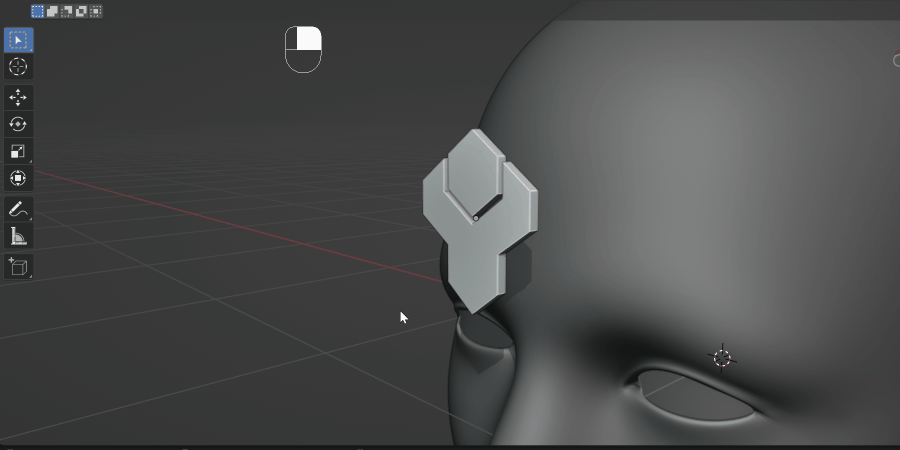
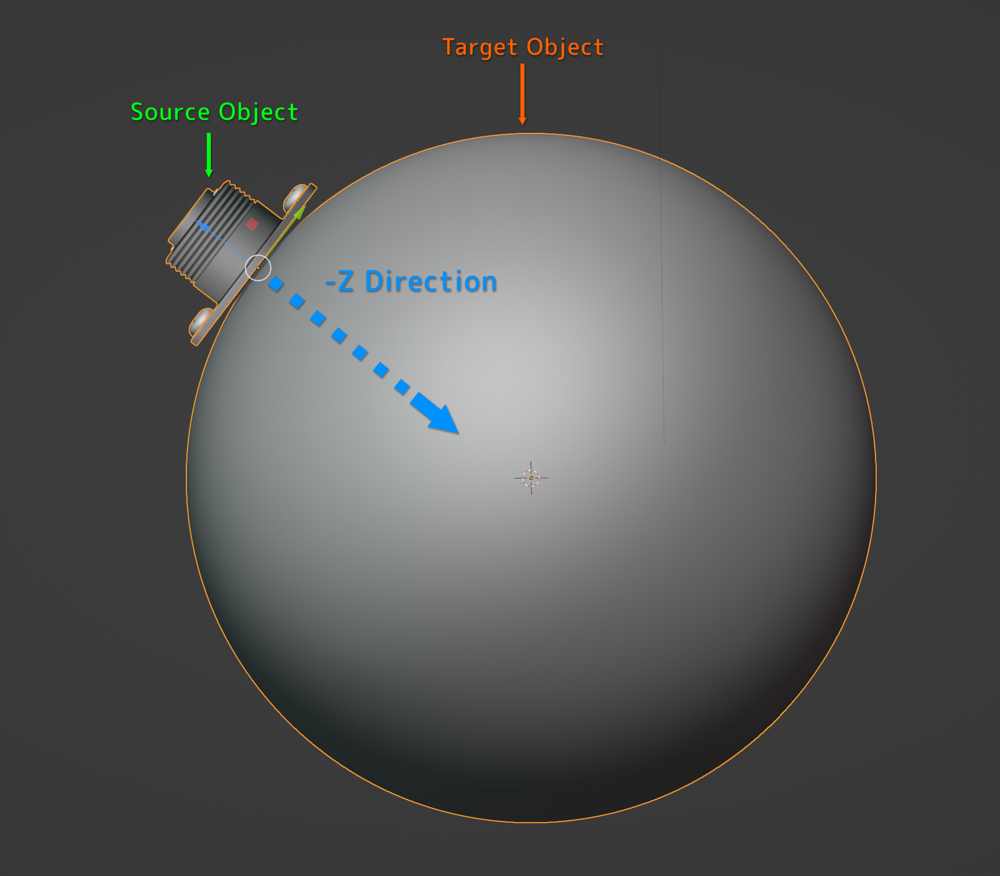
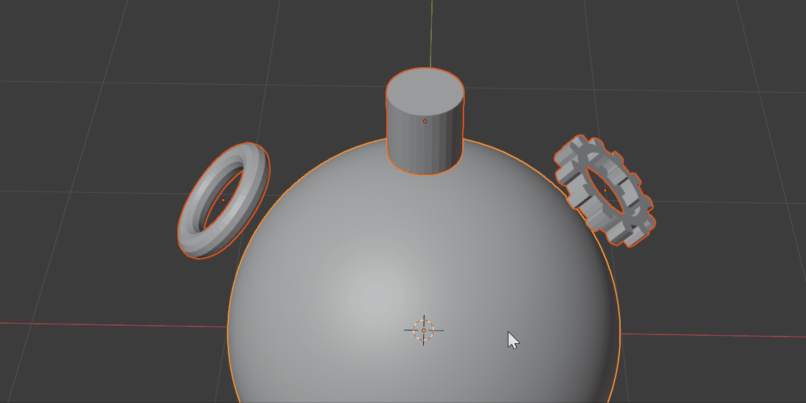

#####################################
How To Use
#####################################

    Select the **Source Object**, then the **Target Object**.  Right-click and select "Conform Object" from the menu.  Disable the :ref:`Gradient Effect` from the :ref:`Options` panel if needed.  Further step by step guide below.

===========================
Step by Step
===========================

    The Source Object is ideally rotated on its local axis so that its base is pointing towards the Target Object.

To conform a  **Source Object** to a **Target Object**:

#. Move and rotate the **Source Object** near, or on top of, the surface of the **Target Object** you wish to wrap it to:

    .. figure:: images/source_object_positioning.jpg
        :alt: Source Object

        Here, the **Source Object** has been rotated 90 degrees and is pointing towards the **Target Object**'s forehead.

    .. warning::

        Ideally, **Source Objects** should:

        * Have a good level of topology so that they can be deformed (good number of vertices and quad faces)
        * Not have modifiers such as booleans which are dependent on other objects.
        * Not have parents/children.
        * Be rotated so that their local -Z axis is aimed towards the **Target Object** surface.  Use the :ref:`Toggle Surface Snapping<Surface Snapping>` feature to align your **Source Object** like this.

    .. tip::

        You can automatically rotate the **Source Object** so that is pointing towards the **Target Object**'s' surface using the  :ref:`Toggle Surface Snapping<Surface Snapping>` option.

#. Select both the **Source Object** and then the **Target Object**:

    .. figure:: images/selected.jpg
        :alt: Both objects selected.

        Both objects selected, with the Target Object being the active object (the last object selected)

    To do this:

    #. First, click the **Source Object** to select it if it isn't already.
    #. Then, hold the *Shift* key, and then click the **Target Object** to select it **last**.  This will make the **Target Object** the active object.

    Both objects need to be selected this way for Conform Object to work.

#. Right-click in the viewport, and select the **Conform Object** menu.  Select **Conform Object**:

    .. figure:: images/conform_object_menu.jpg
        :alt: Conform Object Menu Option.

#. The **Source Object** will then conform to the **Target Object**.  If the :ref:`Gradient Effect` is turned on, you may wish to untick it in the :ref:`options` menu that appears in the bottom left of the viewport:

    .. figure:: images/conform_obj_gradient_effect_toggle.gif
        :alt: Conform Object Menu Option.

        Toggling on and off the :ref:`Gradient Effect`

#. Adjust the rotation of the object if needed by expanding the :ref:`Object Transform` section and adjusting the rotation:

    .. figure:: images/object_conformed_finetune.gif
        :alt: Conform Object rotation.
 
#. The object should now be conformed to the Target Object. Expand the :ref:`Options` panel to adjust more parameters:

    .. figure:: images/object_conformed.gif
        :alt: The object, conformed.

        The object, conformed with the :ref:`Options` panel.

======================================================
Multiple Objects
======================================================

    Conforming multiple objects at once.

It is also possible to conform multiple objects at once using the same operation:

#. Shift-click select the objects you want to conform, and then select the Target Object last (making it the active object).
#. Right-click and select the **Conform Object** sub menu.
#. Select the **Conform Object** option as usual.

You can then edit the :ref:`Options` of all the objects at the same time.

