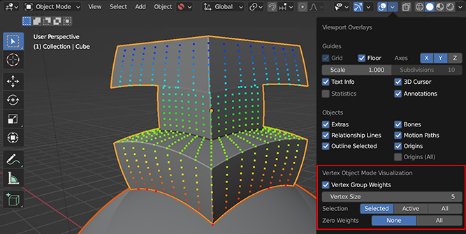

##########################################################################
Visualize Vertex Weights
##########################################################################

    The add-on adds an option to the *Overlays* menu that allows you to visualize vertex weights in Object Mode.

In Blender you do not currently have the option to see Vertex Weights in Object mode, only in Edit Mode.  When the add-on installed, to help you understand the :ref:`Gradient Effect` we have included an extra tool for you to do this.

Strongly weighted vertices will be shown in red, medium weights are shown in green, and zero weighted vertices are shown in blue.

This tool is not tied to Conform Object and can be used to visualize any active Vertex Group on any object.  

.. warning::
    
    Be careful with more complex objects with lots of vertices, as this will slow the viewport down significantly.

To enable the tool:

#. In Blender's viewport, go to the *Show Overlays* menu in the top right:

    .. figure:: images/overlays_menu.jpg
        :alt: Viewing Vertex Weights

#. If the add-on is installed you should see a "Vertex Object Mode Visualization" section:

    .. figure:: images/overlays_menu_vis_option.jpg
        :alt: Viewing Vertex Weights

#. In this section, tick the box next to "Vertex Group Weights".  Now, any selected object with active Vertex Groups should have their weights displayed:

    .. figure:: images/overlays_menu_vis_option_active.jpg
        :alt: Viewing Vertex Weights

.. tip::

    If you want to change which Vertex Group is visualized, change the active Vertex Group by selecting another Vertex Group in the *Object Data Properties* panel:

    .. figure:: images/object_conformed_projection_vert_weight_select.gif
        :alt: Viewing Vertex Weights

.. tip:: 
    
    Visualise a vertex group in Edit Mode by selecting "Vertex Group Weights" in the overlays panel:

    .. image:: images/vertex_group_visualise.jpg
        :alt: Visualising Vertex Groups